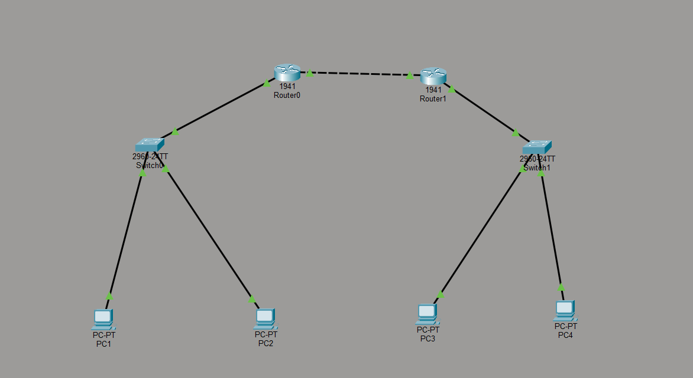

# 🚀 Network Traffic Analysis & VLAN-Based Optimization

## 📌 Overview
This project demonstrates the design, implementation, and analysis of a VLAN-based network using Cisco Packet Tracer. It combines networking concepts with data analysis to evaluate performance and identify optimization opportunities.

---

## 🏗️ Network Architecture
- VLAN 10 (HR) and VLAN 20 (IT)
- Inter-VLAN routing using Router-on-a-Stick
- DHCP for automatic IP allocation
- Multi-router topology for extended network communication

---

## 🖼️ Topology

---

## ⚙️ Key Features
- VLAN segmentation for network isolation
- Trunk configuration between switch and router
- Dynamic IP assignment using DHCP
- Static routing between networks
- End-to-end connectivity validation

---

## 📊 Data Collection
- Latency and packet loss collected using ICMP (ping)
- Bandwidth utilization estimated based on network behavior
- Dataset created to simulate real-world network conditions

---

## 📈 Data Analysis
- Pivot Tables used for VLAN-wise performance comparison
- Charts created to visualize bandwidth and latency trends
- Conditional formatting used to detect anomalies

---

## 🔍 Key Insights
- VLAN 20 showed higher average bandwidth utilization
- Increased bandwidth correlates with higher latency
- Occasional latency spikes observed without packet loss
- Network remained stable under normal operating conditions

---

## 📂 Project Files
| File | Description |
|------|------------|
| topology.png | Network design |
| dataset.xlsx | Collected performance data |
| report.pdf | Detailed explanation |

---

## 🧠 Skills Demonstrated
- Networking (VLAN, Routing, DHCP)
- Troubleshooting & debugging
- Data analysis using Excel
- Network performance evaluation

---

## 🚀 Future Improvements
- Integrate Power BI dashboard
- Automate data collection using scripts
- Implement ACL for security testing

---

## 👤 Author
S TARUN
